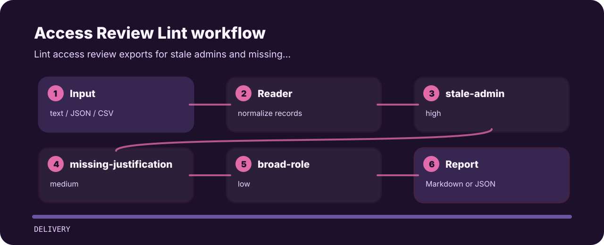

# Access Review Lint


## Why this exists

Lint access review exports for stale admins and missing justification. The command is intentionally direct so it can sit in a local review, a CI step, or a one-off audit.

| Detail | Value |
| --- | --- |
| Area | delivery |
| Entry | `access-review-lint` |
| Input | plain text |
| Output | terminal findings, optional JSON |

## Signal route



| Signal | Level | What it flags | Fix direction |
| --- | --- | --- | --- |
| `stale-admin` | high | stale admin access detected | remove or reapprove privileged access |
| `missing-justification` | medium | access justification is missing | record business reason |
| `broad-role` | low | broad role detected | check least privilege |

## Command path

```bash
git clone https://github.com/mertefekurt/access-review-lint.git
cd access-review-lint
python -m pip install -e ".[dev]"
access-review-lint examples/sample.txt
```
